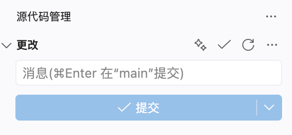

# aicommits for VS Code

在 VS Code 的 Git 提交框中使用 [aicommits](https://github.com/jerryshell/aicommits) 根据暂存的变更生成提交信息。

本扩展可以替代 GitHub Copilot 的 `Generate Commit Message`：调用本地安装的 `aicommits`，再将生成结果写回 VS Code 的 Git 提交输入框。



## 前置条件

请先安装并配置 [aicommits](https://github.com/jerryshell/aicommits)：

```bash
git clone https://github.com/jerryshell/aicommits.git
cd aicommits
bun install
bun run build
bun link
aicommits setup
```

确认命令可用：

```bash
aicommits --help
```

## 安装扩展

在本仓库目录执行：

```bash
npm install
make install
```

`make install` 需要 VS Code 的 `code` 命令可用。也可以先执行 `make package`，再在 VS Code 中通过“从 VSIX 安装”安装生成的 `.vsix` 文件。

安装 VSIX 的详细说明见 [VS Code 扩展安装文档](https://code.visualstudio.com/docs/configure/extensions/extension-marketplace)。

## 使用

1. 在 VS Code 中打开 Git 仓库，并暂存要提交的变更。
2. 在源代码管理面板点击 `aicommits` 按钮，或从命令面板运行 **aicommits: Generate Commit Message**。
3. 生成的提交信息会自动填入提交框，确认后提交。

首次使用或修改配置后，可能需要重启 VS Code，使扩展能找到 `aicommits` 命令。

## 配置

默认配置如下：

```json
{
  "aicommits.command": "aicommits",
  "aicommits.output": "stdout"
}
```

如果使用自定义命令或希望从剪贴板读取结果，可在 VS Code 设置中修改 `aicommits.command` 和 `aicommits.output`。

扩展要求工作区已信任，并依赖 VS Code 内置的 Git 扩展。

## 实现原理

1. `package.json` 注册 `aicommits.generateCommitMessage` 命令，并将它显示在命令面板和 Git 源代码管理面板中。
2. 扩展通过 VS Code 内置的 `vscode.git` API 查找当前 Git 仓库；打开多个仓库时先让用户选择。
3. 扩展从设置中读取 `aicommits.command`，在仓库根目录执行该命令。默认情况下，从标准输出读取生成的提交信息，也支持从系统剪贴板读取。
4. 读取到非空结果后，将它写入 Git 仓库的提交输入框；取消操作、命令超时或执行失败时显示错误提示。

相关 VS Code 文档：

- [扩展命令 API](https://code.visualstudio.com/api/extension-guides/command)
- [激活事件](https://code.visualstudio.com/api/references/activation-events)
- [Git 扩展 API](https://github.com/microsoft/vscode/blob/main/extensions/git/README.md)

## 开发

```bash
npm test
make package
```
